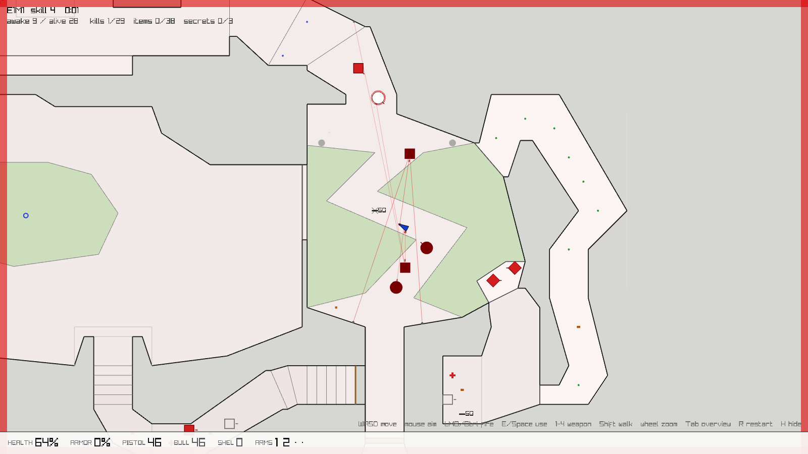
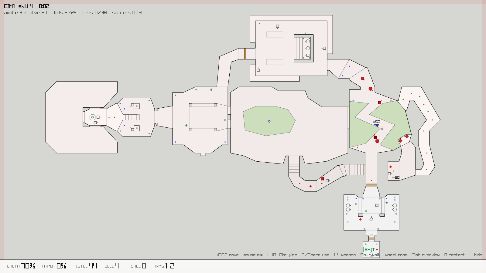

# Essence of DOOM

An experiment: how much can be removed from DOOM before it stops feeling like DOOM?



*One second after walking into E1M1's zig-zag nukage room on Ultra-Violence. Hollow grey shapes
are still asleep. Red ones are awake and hunting. Dark red ones are about to fire. The red lines are their shots.*

It loads the real map data from `DOOM1.WAD` and plays E1M1 as a flat, top-down line drawing.
There are no textures, no sprites and no 3D. The geometry, thing placement, doors, lift, damaging
floors, monster wake-up rules, 8-direction chase logic, attacks and weapon timings all come from
DOOM's data and rules.

The original brief is in [docs/brief.md](docs/brief.md). The specs, design decisions and history
are in [openspec/](openspec/): see `project.md`, `specs/*/spec.md`, and `changes/archive/` for the
proposal, design and tasks of each change.

## Run

```
dotnet run --project src/EssenceOfDoom -c Release
```

The game looks for `DOOM1.WAD` in this order: `--wad <path>`, the `DOOMWAD` environment variable,
the current directory, the executable's directory and its parents, then `~/Downloads`.

Options: `--map E1M1`, `--skill 1-5` (default 4, Ultra-Violence: 29 monsters on E1M1 compared with 6 on skill 3).

| Input | Action |
|---|---|
| WASD / arrows | move (screen-relative, always running) |
| Shift | walk |
| Mouse | aim |
| Left mouse / Ctrl | fire |
| E / Space / right mouse | use (doors, switches): aim at it, 64 units reach |
| 1–4 | fist, pistol, shotgun, chaingun |
| Mouse wheel | zoom |
| Tab | whole-map overview |
| R | restart the level |
| H | hide the help line |

## Reading the drawing



- **Black lines**: walls. **Dark grey**: ledges you can only drop down from, and impassable railings or windows. **Light grey**: walkable steps.
- **Brown lines, tan fill**: doors (the fill disappears as the door opens). Keyed doors take the key's colour.
- **Green fill**: damaging floor (nukage). **Green line marked EXIT**: the exit switch.
- **Blue triangle**: you.
- **Monsters**: circle = zombieman, square = shotgun guy, diamond = imp.
  Hollow grey = dormant. Solid red = awake and hunting. Dark red with a faint line = about to attack.
  A red ring expands when a monster wakes up. Grey × = corpse.
- **Pink flash across rooms**: how far your gunfire just carried. Monsters in those rooms are now alerted.
- **Orange dots**: imp fireballs. **Faint lines**: hitscan tracers (red lines come from monsters).
- Pickups: red cross = health, small blue/green dots = health/armor bonus, rings = armor,
  grey/brown blocks = bullets/shells, `SG`/`CG` = weapons, coloured diamond = key.

## Code

`src/EssenceOfDoom`:

- `Wad.cs`, `Level.cs`: WAD reading, map structures, BSP point-in-sector lookup, a block grid for nearby-line queries
- `Things.cs`: monster, pickup and obstacle tables (numbers from DOOM's info tables)
- `Game.cs`: the 35 Hz simulation: player, weapons, pickups, damage
- `Physics.cs`: collision (DOOM's step, ledge and height rules), line of sight, hitscan, explosions
- `Monsters.cs`: A_Look / A_Chase / P_NewChaseDir behaviour and projectiles
- `Specials.cs`: doors, lift, lowering floor, switches, walk-over triggers, noise propagation
- `Renderer.cs`, `Program.cs`: raylib drawing, input and the main loop

`tests/EssenceOfDoom.Tests` plays the real E1M1 headlessly. The tests cover collision, doors, shooting, waking,
monster attacks, death, pickups, the lift, the exit, and a flood fill that checks the exit can be reached from the start.

```
dotnet test -c Release
```
